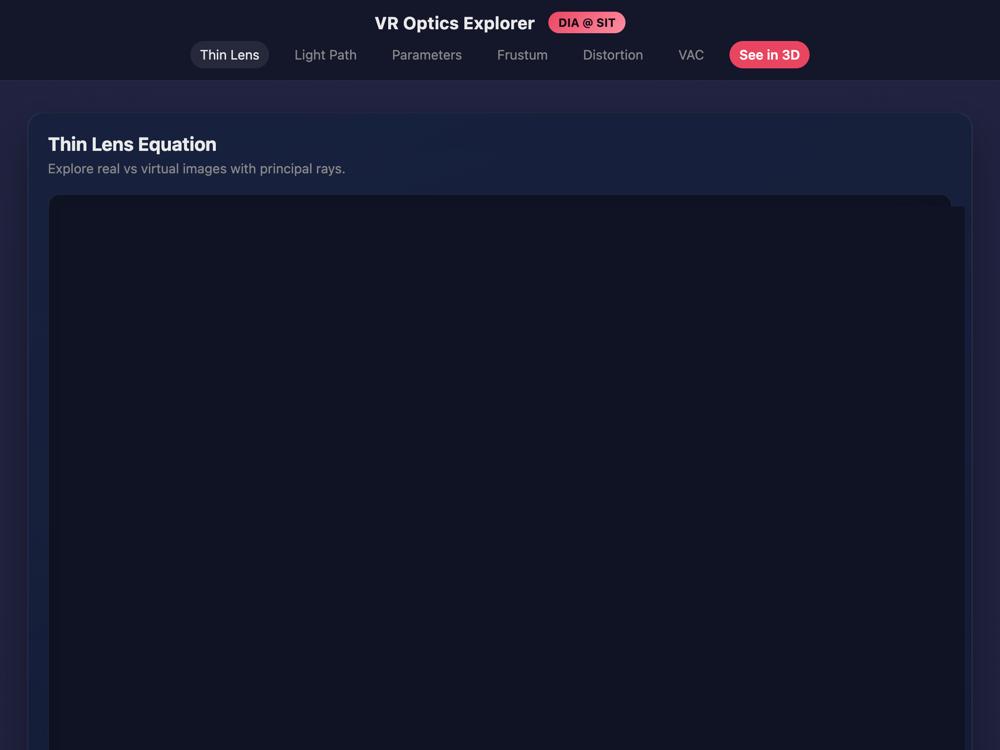

# VR Optics Explorer

Interactive optics explorer for HMD fundamentals, including thin lens behavior, light paths, frustum design, distortion, and VAC.

## Screenshots



## Run locally

```bash
npm install
npm run dev
```
